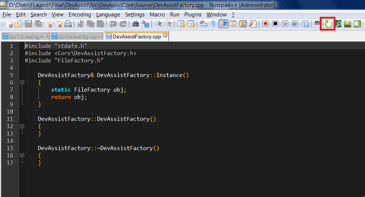
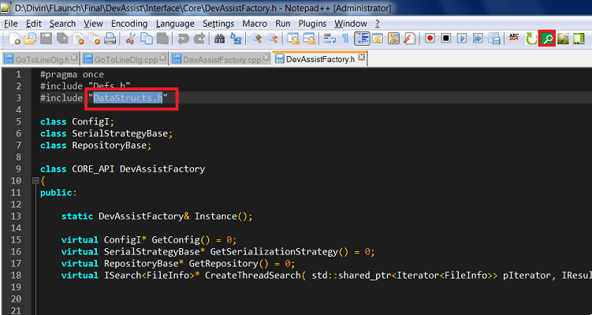
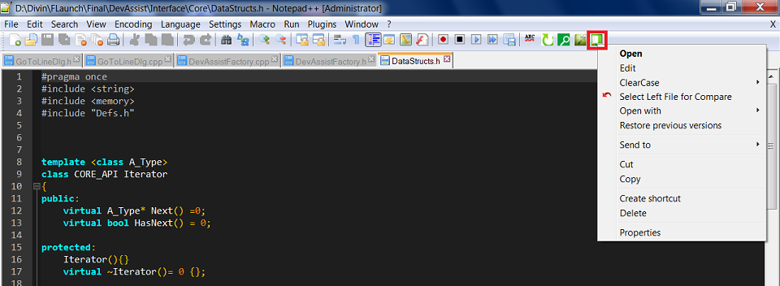

# Features #

##Toggle cpp/header ##

##Search file##
Without selecting any text

With selecting a text

If there is a file with the selected text, it will be opened. otherwise a search and its result will be shown.

##Explorer context menu##

