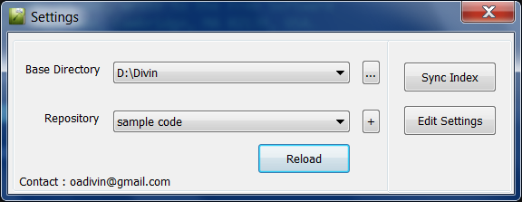
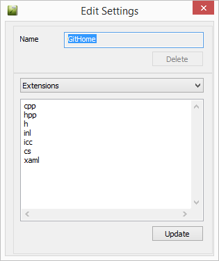
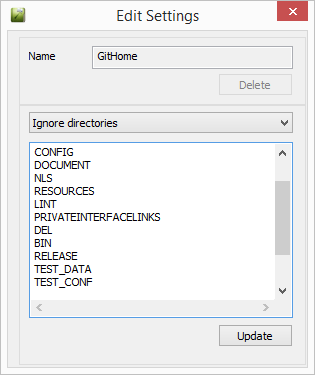
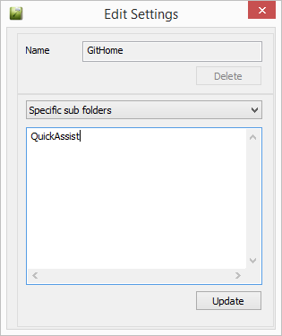

#How to configure#

Run the AddPath.vbs to update the registry with path

##Notepad++##
Copy QuickAssist_npp.dll to Notepad++\Plugins folder 

##Visual Studio##
Edit QuickAssist.AddIn with adding the complete assembly path.

##Set up repository#
Open notepad++/VS click settings icon.

Select the base folder by '...'.

Create the new repository by clicking '+'.

Give a name and click 'Create'.

Change settings, use combo to select multiple options.

Click 'Update' to save and close the dialog.

Click 'Sync Index' to start the indexing.

Click 'Reload' when the indexing is over.
