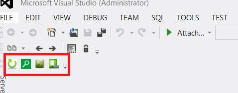

# QuickAssist
An addin to easily search and open files for visual studio and notepad ++

# Screen shots
Loaded in notepad++

Loaded in vs 2012

# Features
1. Toggle cpp/header

2. Search file
  a. Without selecting any text

  b. With selecting a text

If there is a file with the selected text, it will be opened. otherwise a search and its result will be shown.

3. Settings

4. Explorer context menu

