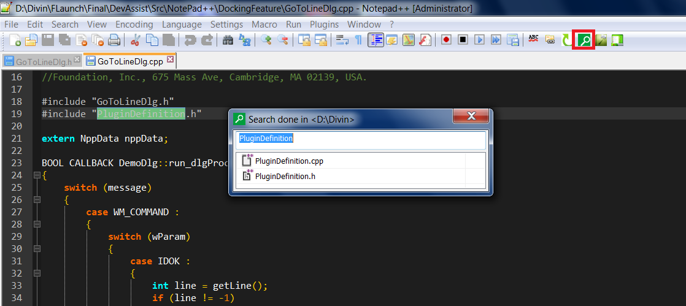

# QuickAssist #
An addin to easily search and open files for visual studio and notepad ++

## Screen shots ##
Loaded in notepad++

Loaded in vs 2012

#Why Quick Assist#
I found it difficult to navigate to files and functions quickly when working with a very large code base. We were relying on make files hence no project files even though we were using visual studio as an editor. To make it worse, the folder structure was hard to remember with lots of sub folders.
Below are the requirements i was looking for in the tool.

1. Simple, no-install utility that can easily be integrated with visual studio and notepad ++
2. Total control over what types of files are getting indexed and from where.
3. Index should be reusable in another machine
4. Indexing should work with a relative path. Useful when working with multiple clearcase views. So most of the time we can live with the same index unless a file addition/removal has been made. Or in scenarios where the code will be stored in a pendrive.

#Components#

#How to configure#
ToDo

# Features #

##Toggle cpp/header ##

##Search file##

Without selecting any text

With selecting a text

If there is a file with the selected text, it will be opened. otherwise a search and its result will be shown.

##Explorer context menu##

