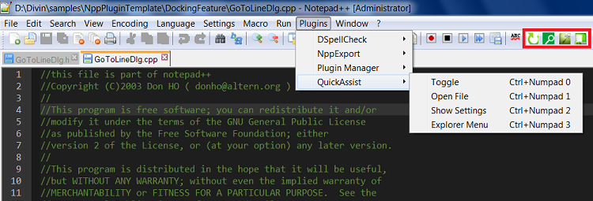

# QuickAssist #
A Visual Studio and  Notepad++ Addin to fast search and open files in large code bases. It works based on a custom portable indexing. It supports file toggle and shell context menu also

## Screen shots ##
Loaded in notepad++

Loaded in vs 2012

#Why Quick Assist#
I found it difficult to navigate to files and functions quickly when working with a very large code base. We were relying on make files hence no project files even though we were using visual studio as an editor. To make it worse, the folder structure was hard to remember with lots of sub folders.
Below are the requirements i was looking for in the tool.

1. Simple, no-install utility that can easily be integrated with visual studio and notepad ++
2. Total control over what types of files are getting indexed and from where.
3. Index should be reusable in another machine
4. Indexing should work with a relative path. Useful when working with multiple clearcase views. So most of the time we can live with the same index unless a file addition/removal has been made. Or in scenarios where the code will be stored in a pendrive.

# Features #

1. Toggle source/header
2. Search file
3. Search files using '&'
4. Jump to a specific file by text selection
5. Show explorer context menu

Read [Docs/Features.md](Docs/Features.md) for more details and screenshots

#How to configure#

Read [Docs/SettingUp.md](Docs/SettingUp.md) for more details and screenshots

#Components#
Read [Docs/Design.md](Docs/Design.md) for more details and screenshots
