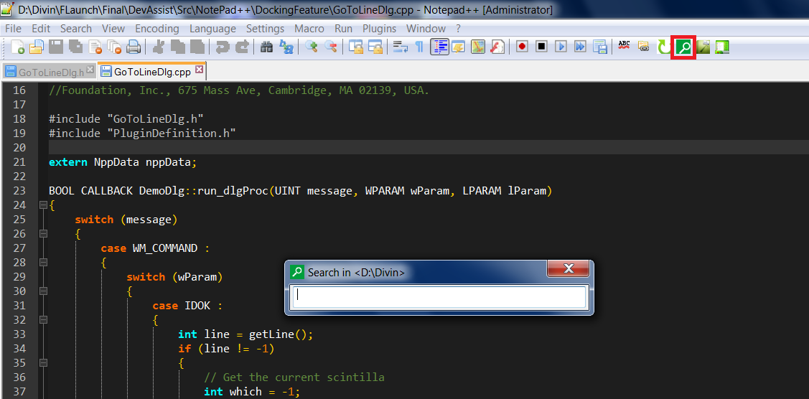
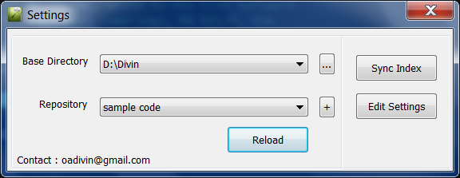
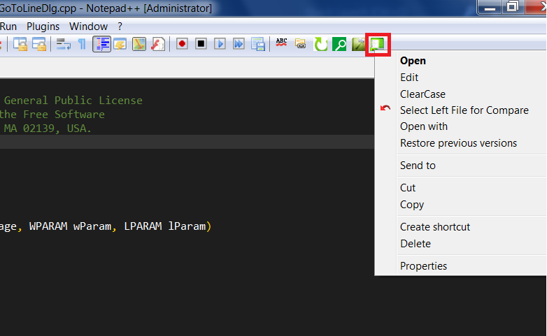

# QuickAssist
An addin to easily search and open files for visual studio and notepad ++

# Screen shots
Loaded in notepad++

Loaded in vs 2012

# How to use
1. Toggle cpp/header
2. Search file
  a. without selecting any text

  b. with selecting a text
  
  if there is a file with the selected text, it will be opened. otherwise a search and its result will be shown.

3. Settings

4. Explorer context menu

 
